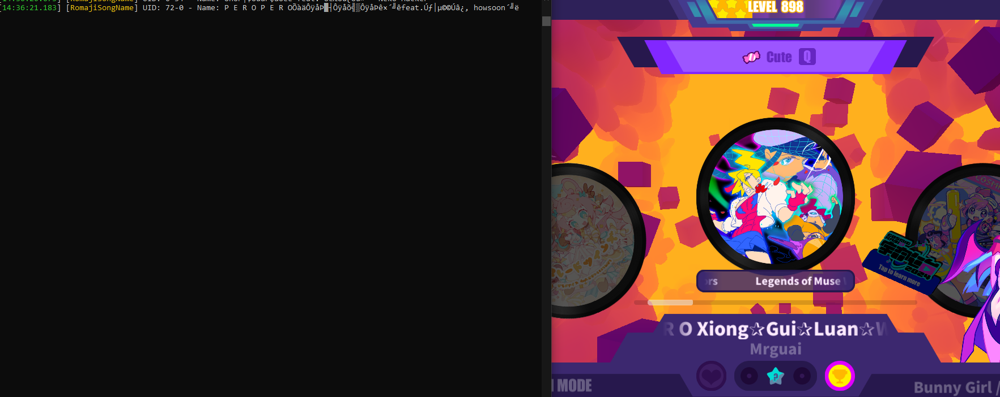
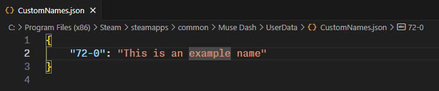
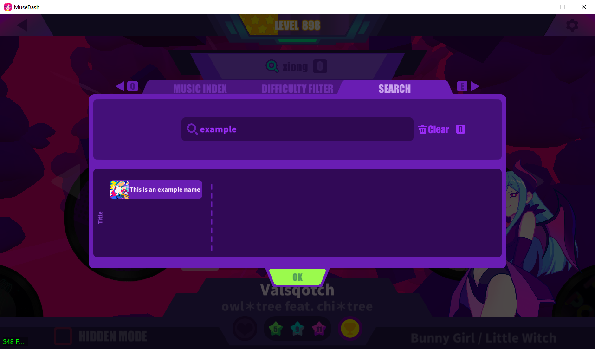

# RomajiSongName

## ❗Check out my other [mods](https://github.com/Asgragrt/AsgraMDMods/blob/main/README.md)❗

~~shouldve called it romanSongName~~

* Works with search :D.
* The artists names weren't romanized.
* Add custom names to songs :D
* ***If u wan't to make improvements to the romanization, PR's or private messages are welcomed :D***.

## Adding custom names

You can customize the songs name to your liking, even overwriting the default romanization (both game default and mod default).

1. Localize your muse dash folder.
2. Go to `${Your muse dash folder}/UserData/RomajiSongName.cfg` and set `DisplayMusicUid` to `true`.
3. Create a file named `CustomNames.json` inside `${Your muse dash folder}/UserData`.
4. Open the game and go to the song you want to replace the localization name. The song uid will be displayed on the console. 
5. Go to the CustomNames.json file and add an entry with the uid as the key, and the new name as the value.

> [!WARNING]
> If the song is a custom album's song, the uid can change if you add more custom songs.
> The uid should not contain any spaces or something like that, and make sure it has the corresponding double quotes.

6. Save the file and restart the game.

> [!TIP]
> You may want to disable `DisplayMusicUid` on your settings to avoid spamming the console.

## Installation

### Prerequisites

* Make sure you have `MelonLoader 0.6.1` or higher installed and working on your Muse Dash.

### Steps

1. Download the latest release from [releases](https://github.com/Asgragrt/RomajiSongName/releases/latest).
2. Move `RomajiSongName.dll` to `${Your muse dash folder}/Mods`.
3. Enable / Disable the mod from the configuration file found at `${Your muse dash folder}/UserData/RomajiSongName.cfg`
